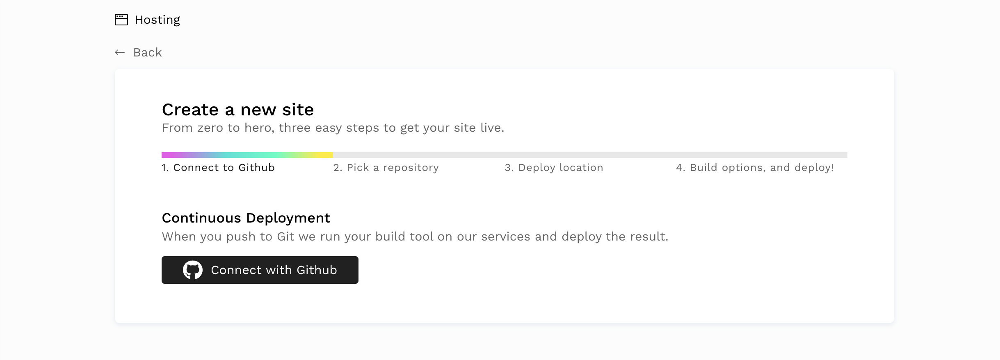
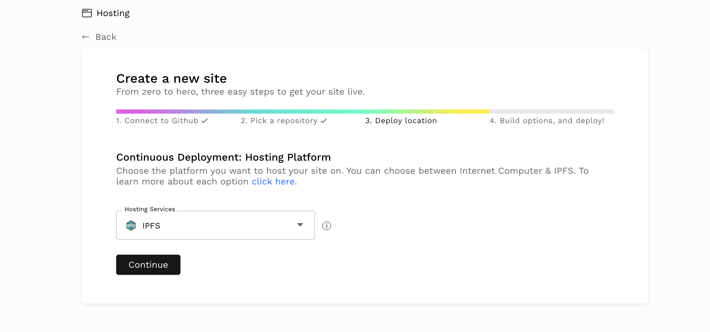
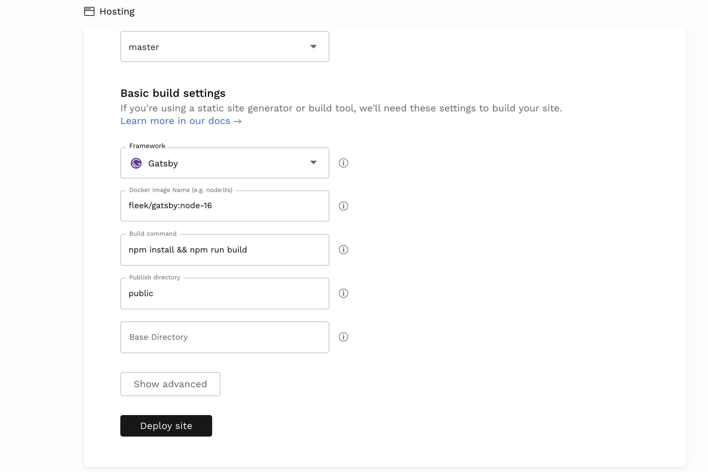
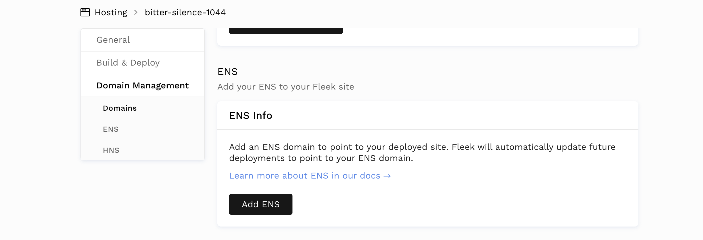
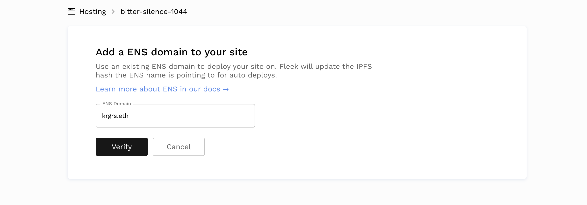
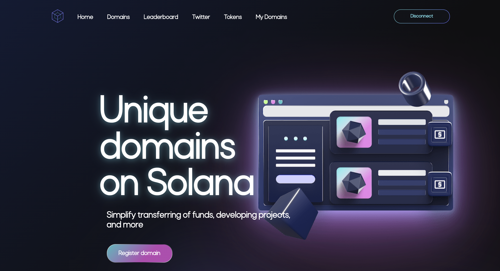
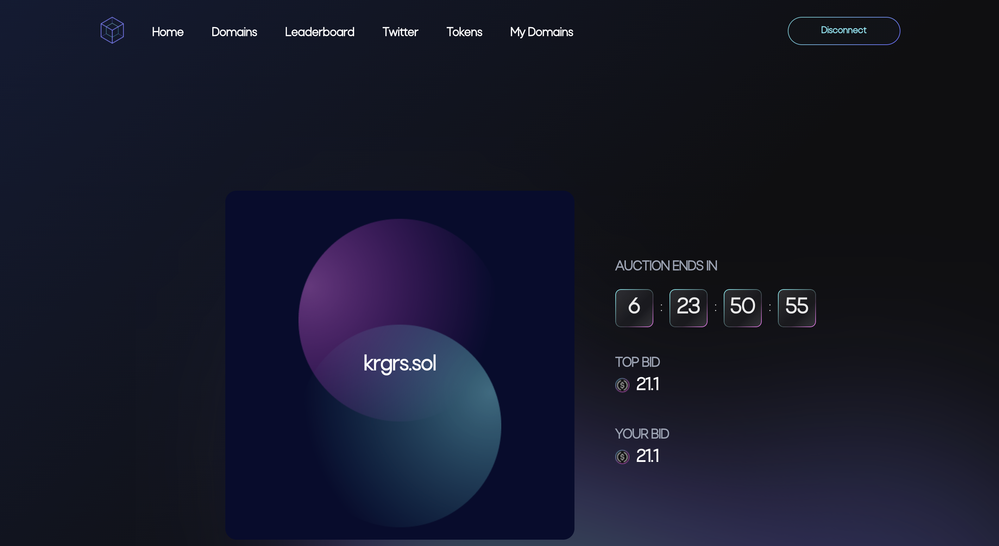
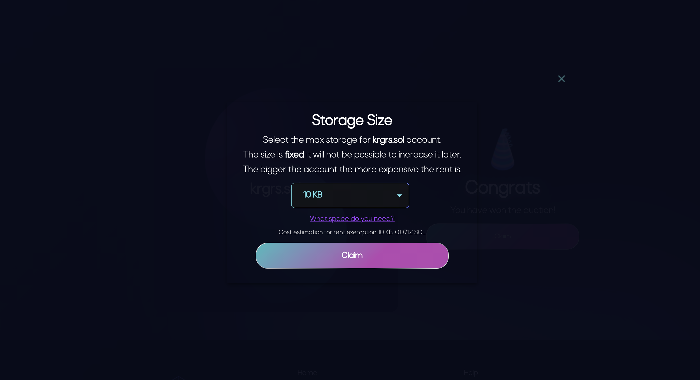

I just recently finished designing and building my new personal site using Gatsby and Tailwind. You can take a look at [krgrs.dev](https://krgrs.dev).

I built it using MDX and designed with Tailwind. I'll be writing an article soon on the process I went through for that, but one thing I really wanted to do was get it up on the blockchain at my ENS domain name, krgrs.eth.

The Gatsby site is already deployed at [krgrs.dev](https://krgrs.dev) and I wanted to get a censorship-resistant one up and running and decided to go with [Fleek](https://fleek.co/) to get it done.

If you've used anything along the lines of Netlify or Gatsby Cloud, Fleek will feel very familiar. The setup process is pretty straightforward. Once you create an account you'll be taken to a screen to add your new site.

This is where you'll be able to connect your GitHub repo to Fleek to set up automatic deployments, just like Netlify.

From here, you'll then choose the repo you want to deploy and where to host it. In my case I'll be using IPFS.

Finally, you'll set up your build settings. In my case, since I'm using Gatsby, Fleek detects the proper build settings automatically. You may need to adjust these depending on what framework you are using for your site build.

We'll hit the deploy button and Fleek will begin building our site, pushing it to IPFS and generating a hash for us, and deploying it to Fleek's CDN.

Once the deployment is finished, Fleek gives us the URL where we can view our newly deployed site. And just like that, in just a few minutes, we have our website built and hosted on IPFS.

But we aren't done yet. As I mentioned earlier, I have an ENS domain name at krgrs.eth, where I would like this site to live. Luckily, Fleek makes that super easy for us as well.

After the site is deployed, we can go over to the Settings, down to Domain Management, and we see a section for ENS domains.

Let's hit that Add ENS button and get our domain hooked up.

This will present us a screen where we can input our ENS domain. What Fleek will do is automatically point our IPFS hash to this domain, so that whenever someone visits our ENS domain, they are served our website.

Fleek will go out and check the address corresponsing to that ENS domain and point the IPFS hash to it.

After you add the domain and verify that the address is correct, you'll need to use your wallet, MetaMask in my case, to set the content hash. You only have to do this once, and Fleek will automatically update the content at the IPFS hash every time you deploy.

**Pay attention to the gas fees here.**

The first time I went to point my IPFS hash to my ENS domain, it would have cost me $415 in gas. I waited a day and tried again and gas was only $29. I'm okay with that, since it's a one time fee. We only have to pay the transaction fee once so Fleek can point the IPFS hash to our ENS domain.

From this point forward, Fleek will update the contents of the IPFS hash for us, so we don't have to worry about transaction fees every time we deploy.

After Fleek finishes setting the hash, we can visit krgrs.eth.limo in Brave to check out the site. ENS domains need to be accessed in a compatible browser like Brave or with a wallet like MetaMask. The `.limo` and `.link` extensions allow us to view the site regardless of what kind of browser we are using.

I want to get this site pointed to a domain on the Solana blockchain as well.

I've recently gotten very interested in developing on Solana, and a company called [Bonfida](https://naming.bonfida.org) started up a domain service on Solana for .sol domains.

In order to get that, we have to initiate an auction. The cool thing with the .sol domains is that you don't have to renew them like ENS domains. Once you buy it, you own it forever.

So I go to [https://naming.bonfida.org](https://naming.bonfida.org/#/) hit the register button and begin the auction process.

When registering a .sol domain, you have to start a 7 day auction process and win the auction in order to claim the domain.

The minimum bid is $21 in USDC, in order to prevent people from just sitting on as many domains as they want. So I went ahead and put my bid in at that price and waited the 7 day period for the auction to end.

I have some Solana in my Phantom wallet, but I need to put the bid in USDC, so I'll use Phantom to swap tokens and put my bid in at 21.1 USDC.

Wait until the auction is over and...

I've got my krgrs.sol domain!

So, the first thing we need to note here is that Bonfida is asking me to choose my size.

What does this mean? Put simply, I need to choose how much data I am able to store on my krgrs.sol domain. This is fixed and cannot be changed later, so the pressure is on to choose the right size.

The size I choose will also determine how much rent I pay. [Rent](https://docs.solana.com/implemented-proposals/rent) is a concept on Solana where you are basically paying for storage space on the Solana blockchain.

So my Solana account can have both a balance (lamports) and a state (data). The amount of data I can have in my account's state is what will be affected by how much rent I pay.

Since my goal is to store my static website on my sol domain, I'm going to select the maximum, 10kb. This will cost me 0.0712 SOL, which is roughly $11 at the time of this writing.

_I realized after writing this that I made a very silly mistake here in thinking that the storage size correlated directly with my static site files. My files are stored on IPFS, the only content required is the IPFS hash, which could have easily been contained in a smaller size._

_But, if I ever need to update the content I have 10kb, so it is what it is. Lesson learned._

So in order to reserve 10kb, I'll need to pay this amount every epoch. The concept of rent is admittedly confusing for me, but there's one big caveat here.

Accounts that have a balance equal to two years worth of rent are expempt from paying. At the time of this writing, my account has more than that, so I'm good here and am exempt from rent.

I will still have to pay this once on the initial transaction, but as long as I maintain that two years' balance I don't have to continue to pay rent.

Now, how do I actually get this domain to point to the IPFS hash where my site currently lives?

Unfortunately, as far as I can tell, you can't do that yet. ENS domains are resovled by the browsers or wallet apps you have installed, they still can't be read by normal browsers.

Brave and MetaMask can currently resolve ENS domains, or you can visit the `.link` or `.limo` versions of your ENS domain to view it on a normal browser.

But no such resolver exists for `.sol` domains yet. Phantom recently came out with support for allowing people to transfer between accounts using `.sol` domains. So now I can send and receive Solana using `krgrs.sol`, but it doesn't look like they support resolving to content hashes like IPFS just yet.

As soon as that functionality becomes available, I'll be sure to get my site up on there and write about the process.
